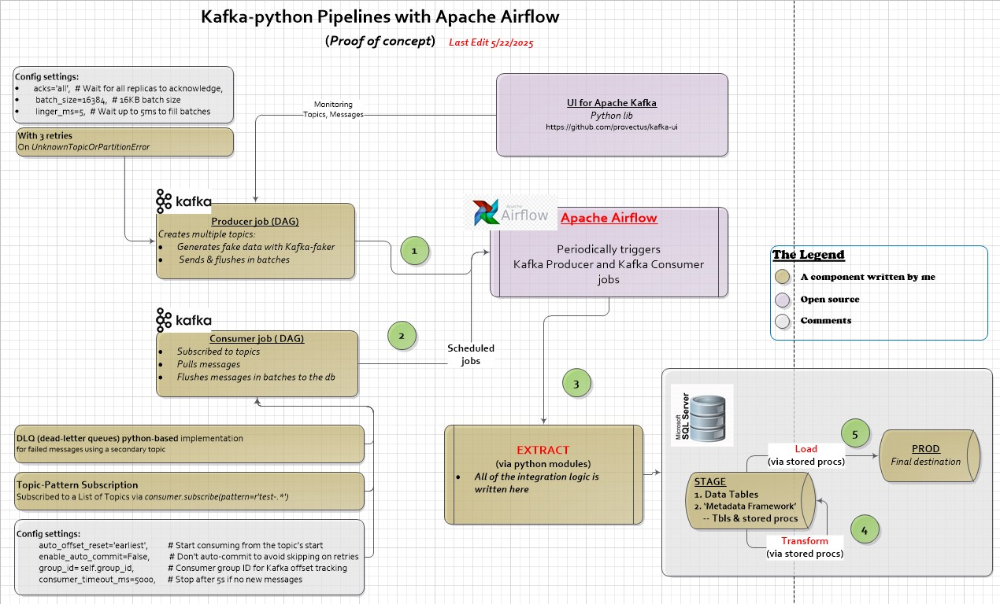
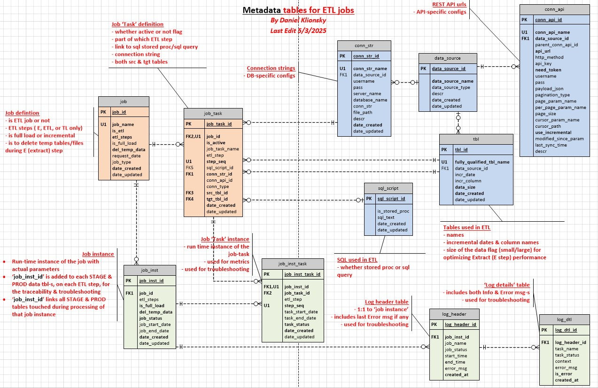

# Kafka python pipelines with Apache Airflow

---

## About

POC for the ingestion of the streaming data into the database with Kafka and Apache Airflow.

This is a part of a larger [Airflow-ETL project](https://github.com/klionsky123/dmk-airflow-etl/blob/main/README.md)

### Watch the Introduction Video on YouTube (3 min):

## ✅ Main Features

- Contains a fully functional, stand-alone set of metadata tables, stored procedures, and python modules to support ETL process.
- Extracts sample steaming data into the database for further processing.
- Scheduled and orchestrated through Apache Airflow.

---

## Tech Stack

- **Kafka**
- **Apache Airflow**
- **Python**
- **MS SQL Server**
- **Docker** 

---

## Project Notes

- MSSQL serves as the destination server and contains both 'Stage' and 'Production' databases
- Apache Airflow, running in Docker, is used for the job scheduling and ETL orchestration.
  
### Project Architecture: 

---

### Custom Metadata-tables for ETL processing 
A fully functional, stand-alone set of metadata tables, stored procedures to support ETL processes on any platform.

### Documentation:

[Kafka-AirFlow-Presentation](https://github.com/klionsky123/dmk-kafka-airflow/blob/main/diagrams/AirFlow-Kafka-Presentation.pdf)

---

## Road Map

- Add support for PostgreSQL metadata store (currently, MS SQL Server only)

