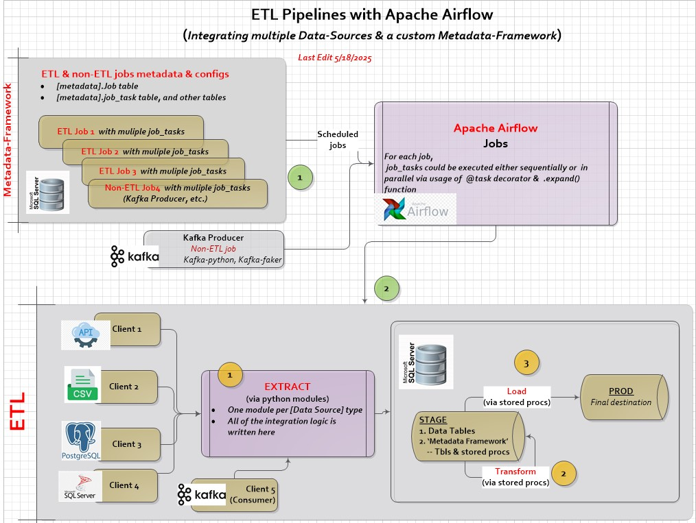

#ETL with Kafka in Apache Airflow

---

## About

POC for insgestion of the streaming data into the databese with Kafka and Apache Airflow.

### Watch the Introduction Video on YouTube (5 min):

## ✅ Main Features

- Contains a fully functional, stand-alone set of metadata tables, stored procedures, and python modules to support ETL processes.
- Extracts sample data from various data sources—flat files, relational databases (RDBMS), REST APIs(token-based auth, pagination, etc.), Kafka streaming, —with a strong emphasis on performance.
- Scheduled and orchestrated through Apache Airflow.

---

## Tech Stack

- **Kafka**
- **Apache Airflow**
- **Python**
- **MS SQL Server**
- **Docker** 

---

## Project Notes

- MSSQL serves as the destination server and contains both 'Stage' and 'Production' databases
- Apache Airflow, running in Docker, is used for the job scheduling and ETL orchestration.
  
### Project Architecture: 

---

## 🧠 ETL-Metadata-framework Database Features

ETL-Metadata-framework is more than just a storage layer for job configs. It also includes Extract SQL queries, tables column mappings and more.

It provides support for 
- `Data Lineage` & Traceability (source systems, intermediate steps, and target destinations).
- Both informational and error db-logging tied to each job execution id.
- `Extract`-only or (`Transform` & `Load`)-only job structures.
- Storage of `Extract` sql queries as well as the tracking of the stored procs (aka 'scripts') used in `Transform` & `Load`.
- Full and Incremental `Extracts` based on incremental dates.
- `Large vs. Small Data` metadata switches resulting in the different approaches for performance (via python layer)
- Task-level activation on/off-switches without modifying the overall job
- Configurable cleanup for the temp structures (extract temp tables, flat files) via metadata on/off-switches

### ETL-Metadata-tables schema 

### Documentation:

[AirFlow-ETL-Presentation](https://github.com/klionsky123/dmk-airflow-etl/blob/main/diagrams/AirFlow-ETL-Presentation.pdf)

---

## Road Map

- Add Use cases for streaming data (Kafka), Parque files (AWS)
- Add support for PostgreSQL metadata store (currently, MS SQL Server only)

